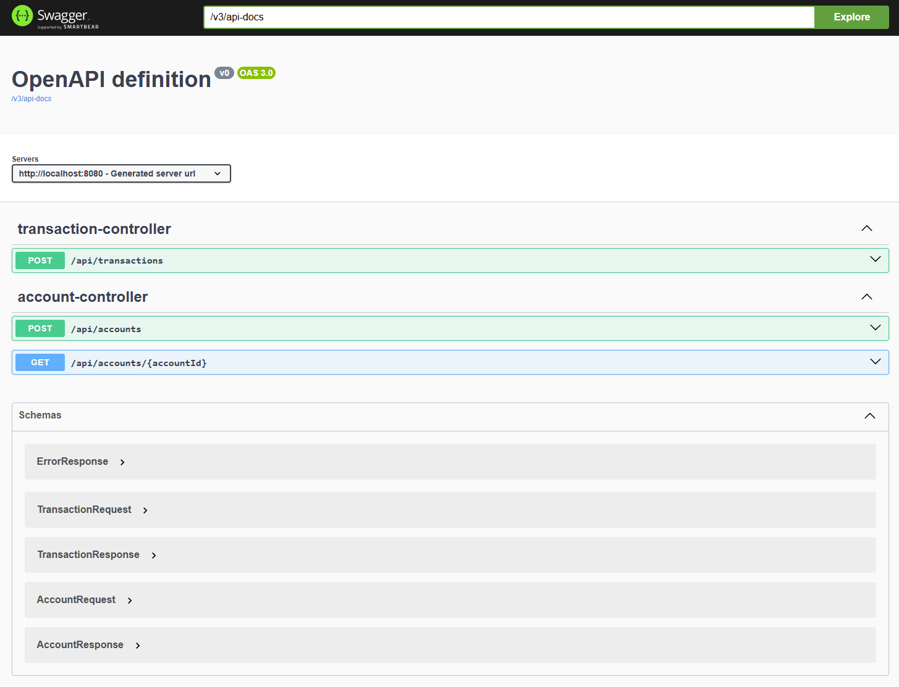
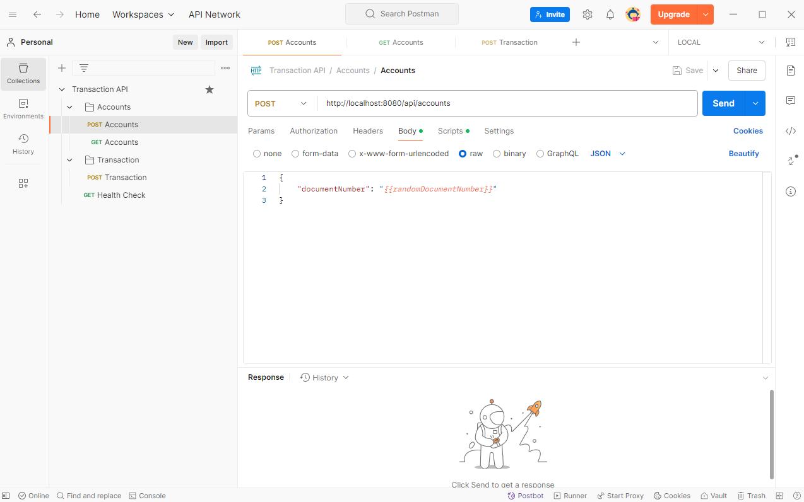

# Transaction API

## Overview

API to manage account transactions using Spring Boot, PostgreSQL, Maven and Docker.

## Architecture Overview

The application is a REST API that allows the creation and retrieval of accounts and its transactions.

The application is divided into the following layers:

- **Boot**: Contains the application configuration.
- **Exception**: Contains the exception handling logic.
- **Controller**: Exposes the REST API endpoints.
- **Service**: Contains the business logic.
- **Repository**: Contains the data repositories.
- **Model**: Contains the data model.
- **Validator**: Contains the validation logic for the request bodies.

The application uses the following frameworks and tools:

- **Spring Boot**: Framework for creating Java applications.
- **Spring WebFlux**: Framework for building reactive applications.
- **Spring Data R2DBC**: Framework for building reactive repositories.
- **Spring log4j2**: Framework for logging.
- **Spring Validator**: Framework for validating request bodies.
- **Spring Actuator**: Framework for monitoring.
- **Lombok**: Library to reduce boilerplate code.
- **PostgreSQL**: Relational database for storing the data.
- **Swagger**: Framework for documenting APIs.

## Prerequisites

For building and running the application you need:

- [JDK 21](https://www.oracle.com/java/technologies/downloads/#jdk21)
- [Maven 3.9](https://maven.apache.org/download.cgi)
- [Docker 20](https://docs.docker.com/get-docker/)

## Usage

To start the Application Docker Container execute the following Bash file:

```bash
  sh start.sh
```

### The steps on the bash file are:

Build of the Spring Boot application using Maven:

```bash
  ./mvnw clean package
```

Build of the Docker image:

```bash
  docker build -t transaction-api . --no-cache
```

Start of the Docker containers (Spring Boot app and Postgres DB):

```bash
  docker compose up
```

## Swagger Documentation

The Swagger documentation provides information about the API endpoints and can be accessed
at http://localhost:8080/swagger-ui/index.html

<p align="center">
  
</p>

## Testing

### Actuator Health Check

In order to test if the application is up, you can call its Health Check endpoint http://localhost:8080/actuator/health

You should get a response similar to this:

```
  {"status":"UP"}
```

### Jacoco

To check the code coverage report open the following HTML file after running the tests:

Mac

```bash
  open target/site/jacoco/index.html
```

Windows

```bash
  start target/site/jacoco/index.html
```

### Postman

To test the API import the Postman
collection [Transaction API.postman_collection.json](qa/postman/Transaction%20API.postman_collection.json)

<p align="center">
  
</p>

## Developer

[David Caaveiro](https://www.linkedin.com/in/davidcaaveiro/)
